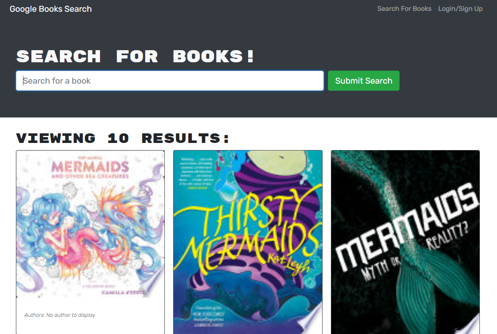

# Book Look

This is a MERN stack web application that uses Google Book Search API, and connects with an Apollo and GraphQL backend.

## Screenshot

## Technologies Used

- MongoDB
- Express
- GraphQL
- Node.js
- React

## Deployed URL

